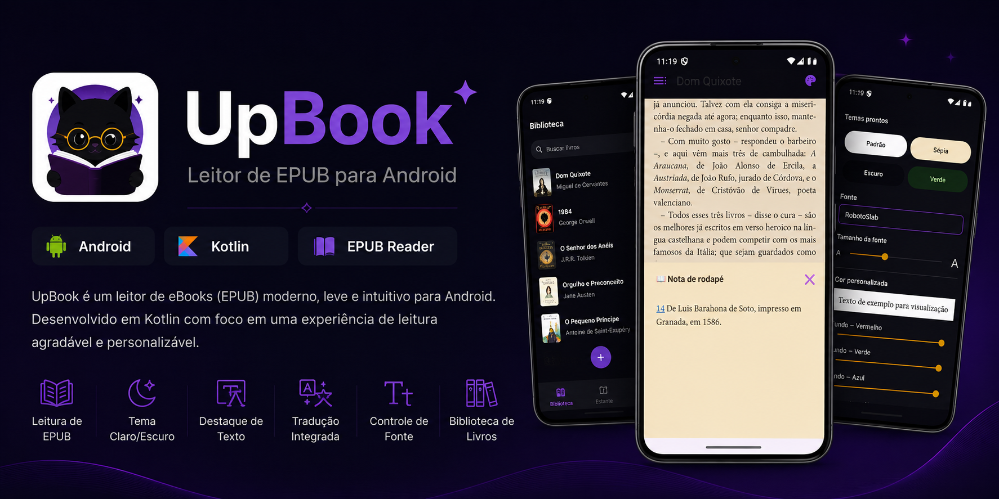
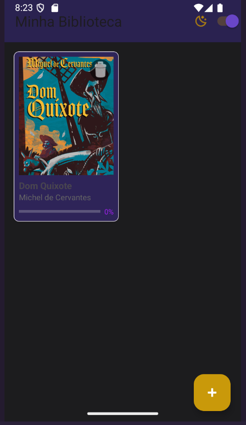
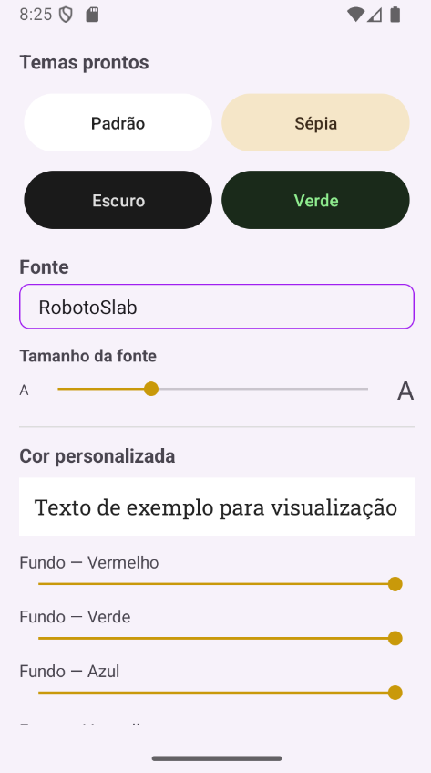

  

## ✨ Funcionalidades

- Leitura de arquivos EPUB
- Alteração de tema (claro/escuro)
- Controle de tamanho da fonte
- Destaque de texto
- Tradução integrada
- Biblioteca de livros

## 🛠 Tecnologias

- Kotlin
- Android SDK
- WebView
- Jetpack Components

  
## 📱 Screenshots

## Tela Inicial

## Leitura

## Funcionalidades

## 🚀 Como executar

1. Clone o projeto
2. Abra no Android Studio
3. Execute o app

